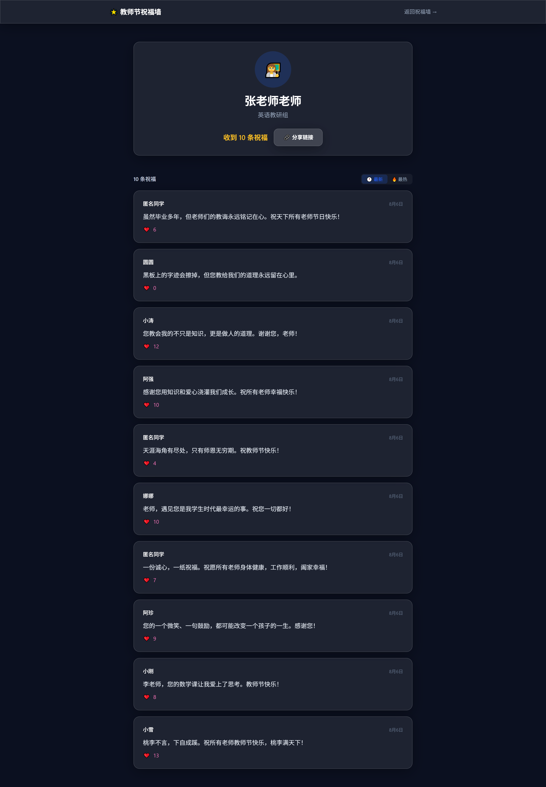
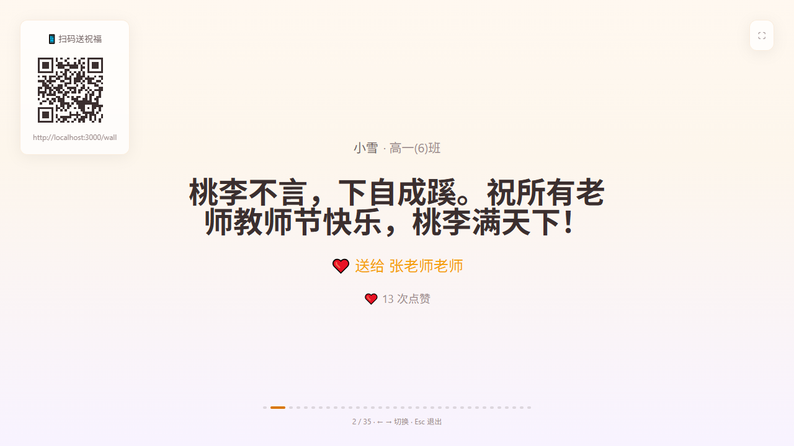

# 🌟 Teacher Wishes Platform · 教师节祝福平台 · v1.3.2

<p align="center">
  <strong>沉浸式教师节活动平台</strong> — 暖色秋天美学 · Design Token 体系 · 祝福星河 · 实时互动 · 大屏展示
</p>

<p align="center">
  <a href="https://github.com/shh32010/Teacher-wishes/actions"></a>
  <a href="./LICENSE"></a>
  <a href="./PROGRESS.md"></a>
  <a href="https://nextjs.org"></a>
  <a href="https://supabase.com"></a>
  
</p>

---

## 📸 预览

<p align="center">
  
  
</p>

<p align="center">
  
  
</p>

---

## 🚀 一键部署

[](https://vercel.com/new/clone?repository-url=https://github.com/shh32010/Teacher-wishes&env=NEXT_PUBLIC_SUPABASE_URL,NEXT_PUBLIC_SUPABASE_ANON_KEY,SUPABASE_SERVICE_ROLE_KEY,ADMIN_EMAIL,ADMIN_PASSWORD&envDescription=Supabase%20密钥%20+%20管理员凭据（必填）)

> ⚠️ 部署前需在 [Supabase](https://supabase.com) 创建项目，并在 SQL Editor 中按文件名自然排序执行 `database/migrations/*.sql`（**共 9 个，全部必执行**）：
> 1. `001_schema.sql` — 基础表结构 + RLS + Realtime
> 2. `002_likes_rpc.sql` — 点赞 RPC 函数
> 3. `003_rate_limit.sql` — IP 限流 RPC 函数
> 4. `004_likes_unique.sql` — 点赞唯一性约束
> 5. `005_storage_avatars.sql` — 头像存储桶策略
> 6. `006_security_hardening.sql` — RLS + 限流原子化 + 权限收紧 + 审核触发器
> 7. `007_storage_policies.sql` — Storage 写策略收紧
> 8. `008_review_fixes.sql` — 审核绕过 + 限流锁定攻击修复
> 9. `009_rate_limit_cleanup.sql` — cleanup RPC / blessing_likes / increment_likes 权限最小化

---

## ✨ 功能

- 🎆 **沉浸式首页** — 暖色渐变背景 + 花瓣/银杏飘落 + 语录渐显 + 渐变标题动画
- 🌌 **祝福星河** — 斐波那契螺旋分布，教师天体（金色光晕）+ 祝福星星（三层辉光），悬浮预览气泡，确定性动画
- 🌓 **主题切换** — 三态循环（☀️ 日间 / 🌙 夜间 / 🖥 自动），localStorage 持久化，温暖深蓝紫夜间模式
- 📝 **发布祝福** — 昵称 / 班级 / 祝福内容 / 教师搜索下拉（含头像）（白色玻璃态弹窗）
- 💬 **祝福墙** — 瀑布流卡片 + 时间/点赞排序 + Supabase Realtime 实时更新 + 无限滚动 + 点赞爱心爆发
- 👩‍🏫 **教师主页** — `/teacher/:id` 教师信息 + 时间/点赞排序 + 精选祝福标记 + 一键分享
- 📺 **大屏模式** — `/display` 全屏自动轮播 + QR 码，适用于活动现场投影
- 🔐 **管理后台** — 审核 / 置顶 / 精选 / 拒绝 / 批量删除 + 教师头像上传 + 数据统计看板
- 🔒 **点赞唯一性** — `blessing_likes` 表 + IP UNIQUE 约束 + RPC 原子递增 + 乐观回滚
- 🛡️ **安全防护** — admin_token HMAC 鉴权 + CSRF 全环境强制 + IP 限流 + RLS + Turnstile
- ♿ **无障碍** — focus-visible 焦点环 + aria-label/role + 弹窗焦点陷阱 + WCAG AA 对比度
- 📊 **监控** — Vercel Analytics 页面统计 + Sentry 错误追踪（DSN 可选激活）

---

## 🛠 技术栈

| 类别 | 技术 |
| :--- | :--- |
| 框架 | Next.js 14 (App Router) + TypeScript |
| 样式 | Tailwind CSS + 毛玻璃（Glassmorphism） |
| 后端 | Supabase（PostgreSQL + RLS + Realtime + Storage） |
| 动画 | Framer Motion / tsParticles v4 / Canvas Confetti |
| 数据请求 | SWR / useSWRInfinite |
| 安全 | CSRF Token + IP Rate Limit + Turnstile + RLS |
| 监控 | Vercel Analytics + Sentry（DSN 可选激活，零配置） |
| 测试 | Vitest（83 单元测试）+ Playwright（25 E2E）+ k6（负载） |
| 性能 | Bundle Analyzer + next/image WebP/AVIF + 懒加载 + CDN 缓存 |
| 部署 | Vercel + Supabase Free（可支撑 200-500 并发） |
| 工程化 | ESLint + Prettier + Husky + lint-staged |

---

## 🚀 本地运行

**前提条件**

- Node.js 18+
- [Supabase](https://supabase.com) 账号（免费）

```bash
# 1. 克隆
git clone git@github.com:shh32010/Teacher-wishes.git
cd Teacher-wishes

# 2. 安装依赖
npm install

# 3. 配置环境变量
cp .env.local.example .env.local
```

编辑 `.env.local`，填入 Supabase 项目信息（Dashboard → Settings → API）：

```env
NEXT_PUBLIC_SUPABASE_URL=https://your-project.supabase.co
NEXT_PUBLIC_SUPABASE_ANON_KEY=your-anon-key
SUPABASE_SERVICE_ROLE_KEY=your-service-role-key
```

```bash
# 4. 执行数据库迁移
# 在 Supabase SQL Editor 中按文件名自然排序执行：
#   database/migrations/001~009（全部 9 个必执行，见上方部署说明）

# 5. 启动
npm run dev
```

访问 `http://localhost:3000`。

---

## 🧪 测试

```bash
npm test                     # Vitest 单元测试（83 用例）
npm run test:e2e             # Playwright E2E（25 用例）
npm run test:e2e:ui          # E2E UI 模式
npm run test:smoke           # k6 冒烟测试
npm run test:load            # k6 负载测试
npm run test:stress          # k6 压力测试
npm run analyze              # Bundle 分析
```

---

## 📁 项目结构

```
src/
├── app/                      # App Router 页面
│   ├── page.tsx              #   首页（暖色渐变 + 星河 + 花瓣飘落）
│   ├── wall/page.tsx         #   祝福墙（无限滚动 + Realtime + 点赞爆发）
│   ├── display/page.tsx      #   大屏模式（轮播 + QR）
│   ├── teacher/[id]/page.tsx #   教师主页（SSR + 排序）
│   ├── admin/                #   管理后台
│   └── api/                  #   API 路由
├── components/
│   ├── ui/                   #   GlassCard / NavHeader / PageTransition / ShareButton
│   ├── blessing/             #   BlessingCard / BlessingForm / SortToggle / LikeBurst
│   ├── home/                 #   StarBackground / BlessingGalaxy / StatsPanel / FallingPetals
│   └── admin/                #   TeacherManager
├── lib/
│   ├── supabase/             #   客户端（浏览器/服务端/实时）
│   ├── csrf.ts / csrf-client.ts
│   └── utils.ts
├── hooks/ / types/ / tests/
└── middleware.ts
e2e/                          # Playwright E2E
load-tests/                   # k6 负载测试
database/migrations/          # SQL 迁移
docs/                         # ARCHITECTURE / API / CAPACITY
```

---

## 📖 文档

| 文档 | 说明 |
| :--- | :--- |
| [CLAUDE.md](./CLAUDE.md) | AI 代码修改指南（当前架构真相） |
| [PROGRESS.md](./PROGRESS.md) | 当前项目状态和任务进度 |
| [CHANGELOG.md](./CHANGELOG.md) | 版本发布历史 |
| [docs/ARCHITECTURE.md](./docs/ARCHITECTURE.md) | 当前系统架构（唯一真相） |
| [docs/API.md](./docs/API.md) | API 端点文档（唯一真相） |
| [docs/SECURITY.md](./docs/SECURITY.md) | 安全模型文档（唯一真相） |
| [docs/OPERATIONS.md](./docs/OPERATIONS.md) | 运维部署指南 |
| [docs/CAPACITY.md](./docs/CAPACITY.md) | 容量评估和压测结果 |

**历史文档**（归档）：
- [docs/archive/TECHNICAL_DESIGN_v1.1.0.md](./docs/archive/TECHNICAL_DESIGN_v1.1.0.md) — v1.1.0 技术设计
- [docs/archive/ARCHITECTURE_REVIEW_2026-08-07.md](./docs/archive/ARCHITECTURE_REVIEW_2026-08-07.md) — 2026-08-07 架构审查
- [docs/archive/VISUAL_REDESIGN_v2.0.md](./docs/archive/VISUAL_REDESIGN_v2.0.md) — 视觉重构方案

---

## 🔮 已发布 / 后续计划

### ✅ v1.3.2 已发布

- [x] 安全收口 — migration 重编号 + 权限最小化 + CSRF 全环境 + requireAdmin 二次鉴权
- [x] 文档重构 — 6 份核心文档 + 3 份归档，单一真相源
- [x] CI/CD — Playwright E2E + 安全回归测试

### 📋 待完成
- [ ] 敏感词过滤（`bad-words` 已安装，服务端逻辑待接入）🔴
- [ ] 后台添加教师 UI — 目前需通过 Supabase SQL / 表编辑器手动插入 🔴
- [ ] 移动端真机走查 + Lighthouse 审计 🔴
- [ ] 移动端 PWA — 独立应用体验
- [ ] 多活动模板 — 毕业季 / 校庆快速复用

---

## 📄 许可

MIT License
