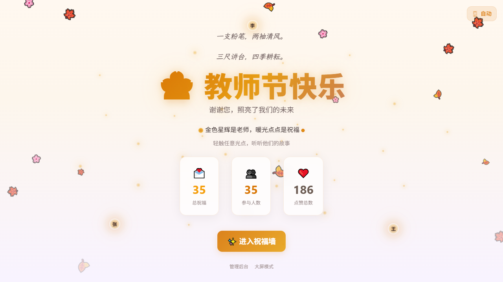
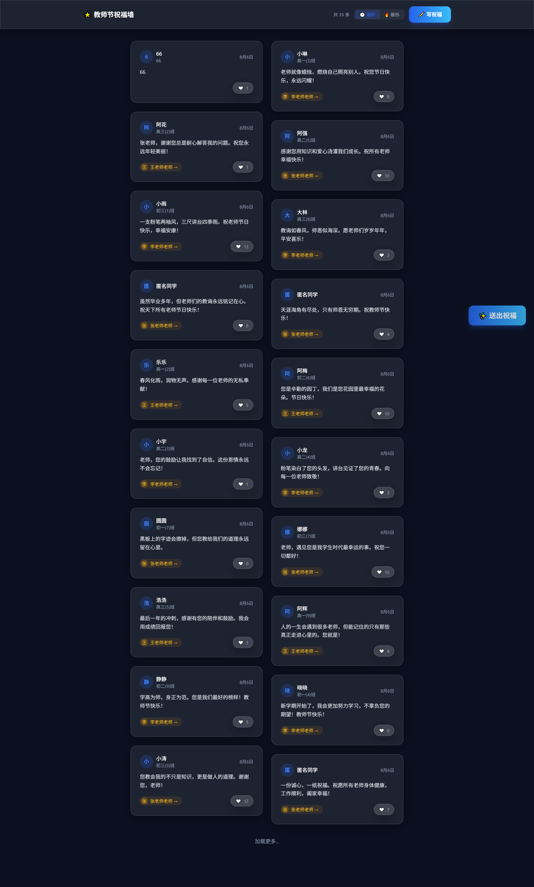

# 🌟 Teacher Wishes · AI 沉浸式教师节送礼平台 · v2.0.0

<p align="center">
  <strong>选择一句祝福 · 送上一份礼物 · 心意化作星河里的光</strong> — 暖色秋天美学 · 祝福语库 · 数字礼物 · AI 全程陪伴
</p>

<p align="center">
  <a href="https://github.com/shh32010/Teacher-wishes/actions"></a>
  <a href="./LICENSE"></a>
  <a href="./PROGRESS.md"></a>
  
</p>

---

## 📸 预览

<p align="center">
  
  
</p>

---

## ✨ 功能

- 🎁 **送礼主流程** — 6 步状态机（选情绪 → AI 推荐祝福 → 选礼物 → 确认 → 沉浸式动画 → 星河汇聚），3 秒冷却 + IP 限流防刷
- 📚 **甲方祝福语库** — 学生从官方词库选择祝福（不再自由输入）；后台支持单条 CRUD + CSV 批量导入 + AI 自动分类
- 🎀 **数字礼物系统** — 8 种礼物（鲜花/星星/书本/粉笔/咖啡/信件/苹果/小树）+ 8 种定制动画，礼物化作光点飞入星河
- 🌌 **教师节祝福星河** — 中心 TEACHERS 光核 + 教师天体外圈 + 礼物粒子环绕；不比较老师，全校心意汇聚
- 💬 **祝福墙（同句聚合）** — 同一句祝福多人送出时合并展示「N 位同学送出了这句祝福」，统一献给全体老师
- 🤖 **AI 智能赋能** — DeepSeek adapter（可切智谱/SiliconFlow）：智能祝福推荐（DB 语义匹配，零 LLM 零延迟）、词库批量分类、精选金句、全校情绪洞察、收官总结；**无 key 时全部规则降级，AI 故障不影响核心链路**
- 🔐 **管理后台** — 活动概览 / 祝福管理（记录+语库）/ 礼物管理 / AI 中心 / 活动设置 5 大模块
- 🛡️ **安全防护** — admin_token HMAC 二次验签 + CSRF 全环境强制 + 服务端取词契约 + 严格触发器（数据库层防绕过）+ RLS + Turnstile
- ♿ **无障碍 + 监控** — WCAG AA、焦点陷阱、Vercel Analytics、Sentry

---

## 🛠 技术栈

| 类别 | 技术 |
| :--- | :--- |
| 框架 | Next.js 14 (App Router) + TypeScript |
| 样式 | Tailwind CSS + 毛玻璃（Glassmorphism） |
| 后端 | Supabase（PostgreSQL + RLS + Realtime + Storage） |
| AI | DeepSeek（openai 兼容 adapter + 规则降级） |
| 动画 | Framer Motion / tsParticles v4 / Canvas Confetti |
| 数据请求 | SWR / Supabase Realtime |
| 安全 | CSRF + IP 限流 + Turnstile + RLS + 严格触发器 |
| 测试 | Vitest（102）+ Playwright（23）+ k6 |
| 部署 | Vercel + Supabase |

---

## 🚀 本地运行

**前提**：Node.js 18+、Supabase 账号

```bash
# 1. 克隆 + 安装
git clone git@github.com:shh32010/Teacher-wishes.git
cd Teacher-wishes
npm install

# 2. 配置环境变量（Supabase Dashboard → Settings → API）
cp .env.local.example .env.local
```

编辑 `.env.local`：

```env
NEXT_PUBLIC_SUPABASE_URL=https://your-project.supabase.co
NEXT_PUBLIC_SUPABASE_ANON_KEY=your-anon-key
SUPABASE_SERVICE_ROLE_KEY=your-service-role-key
ADMIN_PASSWORD=your-admin-password
ADMIN_TOKEN_SECRET=your-token-secret        # 生产强制
AI_PROVIDER=deepseek                        # 可选，未配置时 AI 走规则降级
AI_API_KEY=your-ai-key                      # 可选
```

```bash
# 3. 执行数据库迁移（Supabase SQL Editor，按文件名顺序）
#    001~012 全部执行；013 严格触发器须与 v2 前端同步上线后执行

# 4. 启动
npm run dev
```

访问 `http://localhost:3000`。

---

## 🧪 测试

```bash
npm test                     # Vitest 单元测试（102 用例）
npm run test:e2e             # Playwright E2E（23 用例）
npm run test:security        # 数据库安全回归（RLS/权限断言）
npm run test:smoke           # k6 冒烟测试
npm run test:load            # k6 负载测试
npm run test:stress          # k6 压力测试
```

---

## 📁 项目结构

```
src/
├── app/
│   ├── page.tsx              #   首页（时间线 + 礼物星河 + 精选金句）
│   ├── gift/page.tsx         #   送礼主流程（6 步状态机）
│   ├── wall/page.tsx         #   祝福墙（同句聚合 + Realtime）
│   ├── admin/                #   管理后台（5 面板）
│   └── api/                  #   blessings/templates/gifts/ai/admin/csrf/cron
├── components/
│   ├── gift/                 #   GiftFlow / TemplatePicker / GiftSelector / GiftAnimation 等
│   ├── blessing/             #   GroupedBlessingCard / LikeBurst
│   ├── home/                 #   GiftGalaxy / StarBackground / StatsPanel / FallingPetals
│   ├── ai/                   #   QuoteOfDay
│   ├── admin/                #   OverviewPanel / TemplateManager / GiftManager / AICenter / SettingsPanel
│   └── ui/                   #   GlassCard / NavHeader / PageTransition
├── lib/
│   ├── ai/                   #   provider（DeepSeek adapter）/ prompts / 仪式文案矩阵
│   ├── supabase/             #   客户端（浏览器/服务端/实时）
│   ├── group-blessings.ts    #   同句聚合纯函数
│   ├── csv.ts / profanity.ts / csrf.ts / client-ip.ts
│   └── auth/admin.ts
├── hooks/ / types/ / tests/
└── middleware.ts
e2e/                          # Playwright E2E
load-tests/                   # k6 负载测试
database/                     # migrations（001~017）+ 迁移执行脚本 + 安全回归
docs/                         # 架构 / API / 安全 / 运维 / 容量 / V2 设计蓝图
```

---

## 📖 文档

| 文档 | 说明 |
| :--- | :--- |
| [docs/V2_DESIGN.md](./docs/V2_DESIGN.md) | **v2.0 设计蓝图**（产品定位 + AI 创意点 + 决策记录） |
| [CLAUDE.md](./CLAUDE.md) | AI 代码修改指南（当前架构真相） |
| [PROGRESS.md](./PROGRESS.md) | 项目状态与任务进度 |
| [CHANGELOG.md](./CHANGELOG.md) | 版本发布历史 |
| [docs/ARCHITECTURE.md](./docs/ARCHITECTURE.md) | 系统架构（唯一真相） |
| [docs/API.md](./docs/API.md) | API 端点文档（唯一真相） |
| [docs/SECURITY.md](./docs/SECURITY.md) | 安全模型文档（唯一真相） |
| [docs/OPERATIONS.md](./docs/OPERATIONS.md) | 运维部署指南 |
| [docs/CAPACITY.md](./docs/CAPACITY.md) | 容量评估和压测结果 |

---

## 📄 许可

MIT License
