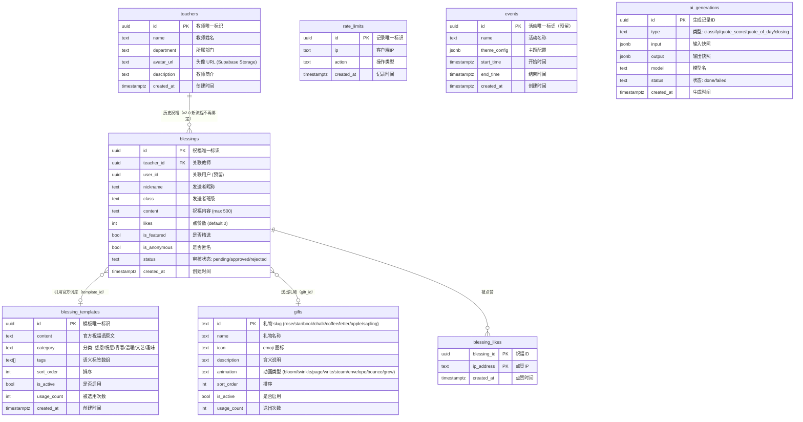
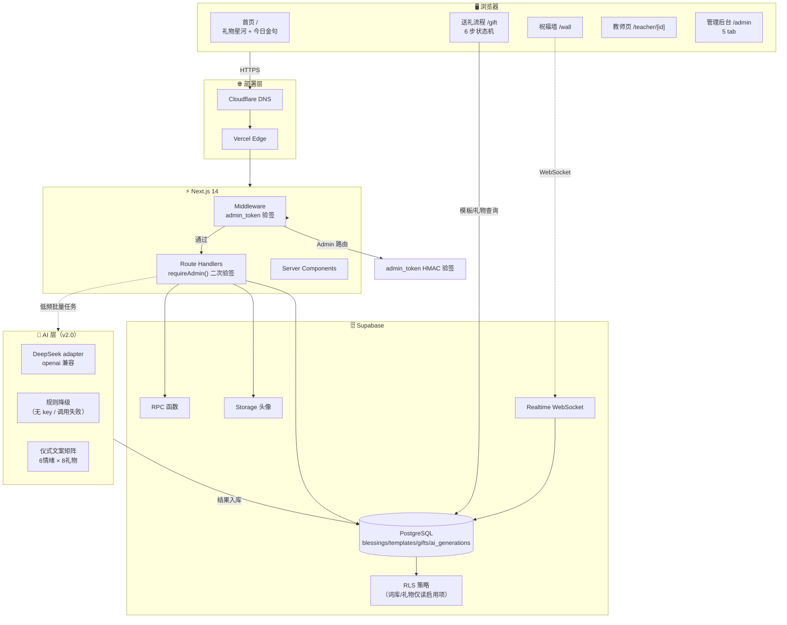
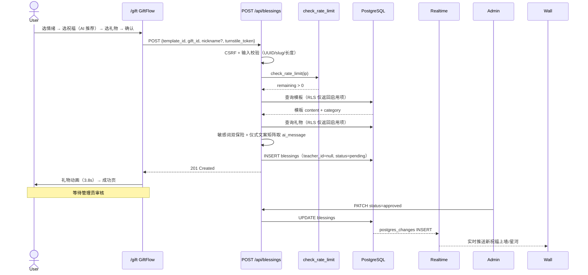
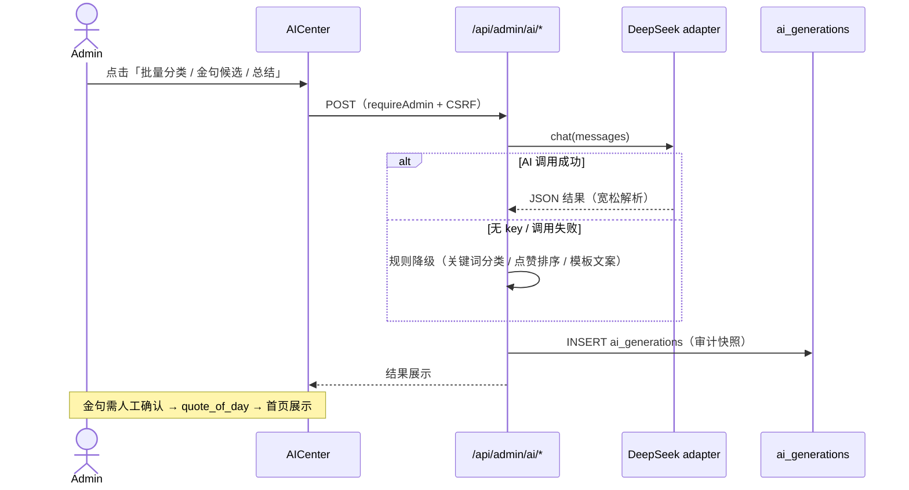
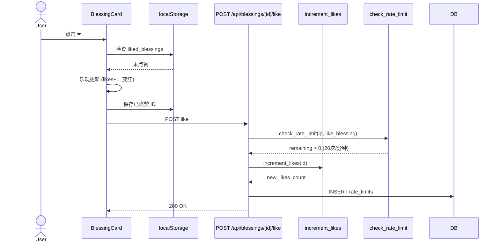

# 🏗 架构文档 — 教师节祝福墙

> **版本状态**：v2.0.0 开发中，目标 **2026-09-05** 上线。v2.0 设计蓝图见 [`docs/V2_DESIGN.md`](./V2_DESIGN.md)（2026-08-29 定稿），本文档按 v2.0 目标架构描述。

---

## 技术栈

| 层 | 技术 |
| :--- | :--- |
| **前端框架** | Next.js 14 (App Router) + TypeScript |
| **样式** | Tailwind CSS（Glassmorphism 毛玻璃主题） |
| **动画** | Framer Motion + tsParticles v4 + Canvas Confetti |
| **数据获取** | SWR + useSWRInfinite + Supabase Realtime |
| **后端 API** | Next.js Route Handlers |
| **数据库** | Supabase PostgreSQL + RLS + Realtime |
| **存储** | Supabase Storage（教师头像） |
| **认证** | Admin: admin_token HMAC (Supabase Auth 不参与) |
| **AI（v2.0）** | DeepSeek adapter（openai 兼容，备选智谱/SiliconFlow）+ 无 key 规则降级 |
| **部署** | Vercel + Cloudflare DNS 代理 |
| **测试** | Vitest + Playwright E2E + k6 负载测试 |

---

## 目录结构

```
├── src/
│   ├── app/                       # Next.js App Router
│   │   ├── page.tsx               # 首页（时间线 + 礼物星河 + 今日金句）
│   │   ├── layout.tsx             # 根布局 + SEO metadata
│   │   ├── gift/page.tsx          # v2.0 送礼主流程（6 步状态机）
│   │   ├── wall/page.tsx          # 祝福墙（无限滚动 + Realtime）
│   │   ├── teacher/[id]/page.tsx  # 教师主页（SSR，历史祝福）
│   │   ├── admin/
│   │   │   ├── page.tsx           # 管理后台（审核/词库/礼物/AI 中心/教师 5 tab）
│   │   │   └── login/page.tsx     # 管理员登录
│   │   └── api/                   # API Route Handlers
│   │       ├── blessings/         # 祝福 CRUD + 点赞 + 统计（v2.0 送礼契约）
│   │       ├── teachers/          # 教师列表 + 详情
│   │       ├── templates/         # v2.0 公开词库（含 random）
│   │       ├── gifts/             # v2.0 公开礼物
│   │       ├── ai/                # v2.0 AI（recommend/quote/insights）
│   │       └── admin/             # 管理端（blessings/templates/gifts/ai/login/logout/upload）
│   ├── components/
│   │   ├── home/                  # 首页组件
│   │   │   ├── StarBackground.tsx # tsParticles 星空
│   │   │   ├── GiftGalaxy.tsx     # v2.0 礼物星河（中心 TEACHERS 光核 + 礼物粒子）
│   │   │   ├── StatsPanel.tsx     # 数据看板
│   │   │   ├── CountUp.tsx        # 数字滚动动画
│   │   │   └── FallingPetals.tsx  # 花瓣飘落动画
│   │   ├── blessing/              # 祝福相关组件
│   │   │   ├── BlessingCard.tsx   # 祝福卡片（礼物/情绪标签 + 点赞）
│   │   │   ├── ConfettiTrigger.tsx # 彩带庆祝特效
│   │   │   ├── LikeBurst.tsx      # 点赞爱心爆发动画
│   │   │   └── SortToggle.tsx     # 排序切换按钮
│   │   ├── gift/                  # v2.0 送礼流程组件
│   │   │   ├── GiftFlow.tsx       # 6 步状态机容器（含确认步 + Turnstile）
│   │   │   ├── EmotionPicker.tsx  # 情绪选择
│   │   │   ├── TemplatePicker.tsx # 祝福选择（AI 推荐 + 换一句 + 分类浏览）
│   │   │   ├── GiftSelector.tsx   # 礼物宫格
│   │   │   ├── GiftAnimation.tsx  # 8 种礼物动画（3.8s）
│   │   │   └── GiftSuccess.tsx    # 完成页 + 分享
│   │   ├── ai/                    # v2.0 AI 展示组件
│   │   │   └── QuoteOfDay.tsx     # 今日金句
│   │   ├── admin/                 # 管理后台组件
│   │   │   ├── TeacherManager.tsx # 教师管理面板
│   │   │   ├── TemplateManager.tsx # v2.0 词库管理（含 CSV 导入）
│   │   │   ├── GiftManager.tsx    # v2.0 礼物管理
│   │   │   └── AICenter.tsx       # v2.0 AI 中心（分类/金句/总结/洞察）
│   │   └── ui/                    # 通用 UI 组件
│   │       ├── GlassCard.tsx      # 毛玻璃卡片
│   │       ├── NavHeader.tsx      # 玻璃态导航栏
│   │       ├── PageTransition.tsx # 页面转场动画
│   │       ├── ThemeToggle.tsx    # 主题切换按钮
│   │       └── ShareButton.tsx    # 分享链接复制
│   ├── lib/
│   │   ├── supabase/              # Supabase 客户端封装
│   │   │   ├── client.ts          # 浏览器端（含 Realtime）
│   │   │   └── server.ts          # 服务端（含 Admin + Anon）
│   │   ├── ai/                    # v2.0 AI 层
│   │   │   ├── provider.ts        # adapter（DeepSeek 默认 + 宽松 JSON 解析）
│   │   │   ├── prompts.ts         # 提示词 + 规则降级（ruleClassify）
│   │   │   └── messages.ts        # 仪式文案矩阵（6 情绪 × 8 礼物）
│   │   ├── auth/admin.ts          # 管理员认证（requireAdmin）
│   │   ├── csrf.ts                # CSRF 令牌生成（Double Submit Cookie）
│   │   ├── csrf-client.ts         # 客户端 CSRF 工具（缓存 + 获取）
│   │   ├── csv.ts                 # v2.0 CSV 解析（RFC 4180 子集）
│   │   ├── client-ip.ts           # 客户端 IP 获取
│   │   ├── profanity.ts           # 敏感词过滤（词库导入双保险）
│   │   └── utils.ts               # 工具函数
│   ├── hooks/
│   │   ├── useInfiniteScroll.ts   # 无限滚动 Hook
│   │   ├── useTheme.ts            # 主题切换 Hook
│   │   └── useTurnstile.ts        # v2.0 Turnstile Hook（widget 生命周期）
│   ├── types/
│   │   ├── index.ts               # 全局类型定义（含 v2.0 模板/礼物/AI 类型）
│   │   └── turnstile.d.ts         # Turnstile 类型声明
│   ├── tests/                     # 测试文件
│   │   ├── setup.ts               # Vitest 配置
│   │   ├── utils.test.ts          # 工具函数测试
│   │   ├── validation.test.ts     # API 验证逻辑测试
│   │   ├── api-types.test.ts      # API 类型守卫测试
│   │   ├── csv.test.ts            # v2.0 CSV 解析测试
│   │   ├── ai-lib.test.ts         # v2.0 AI 工具层测试
│   │   ├── GlassCard.test.tsx     # GlassCard 组件测试
│   │   └── BlessingCard.test.tsx  # BlessingCard 组件测试
│   └── middleware.ts              # Admin 路由鉴权中间件
├── e2e/                           # Playwright E2E 测试
│   ├── homepage.spec.ts           # 首页测试
│   ├── gift.spec.ts               # v2.0 送礼流程测试
│   ├── blessing.spec.ts           # 祝福墙测试
│   ├── admin.spec.ts              # 管理后台测试
│   ├── teacher.spec.ts            # 教师页测试
│   └── a11y.spec.ts               # 无障碍测试
├── load-tests/                    # k6 负载测试（v2.0 契约）
│   ├── smoke.js                   # 冒烟测试
│   ├── load.js                    # 负载测试
│   └── stress.js                  # 压力测试
├── database/
│   └── migrations/                # SQL 迁移脚本（001~013）
├── docs/                          # 文档（含 V2_DESIGN.md 设计蓝图）
└── public/                        # 静态资源
```

> **v2.0 移除**：大屏模式 `/display`、`QRCode.tsx`、`BlessingForm.tsx`（逻辑并入 GiftFlow）、`BlessingGalaxy.tsx`（由 GiftGalaxy 替代）。

---

## ER 图



---

## 数据流图



---

## 核心交互流程

### 送礼提交（v2.0）



### AI 后台任务（v2.0，低频手动触发）



### 点赞流程



---

## 安全模型

| 层 | 机制 |
| :--- | :--- |
| **传输** | HTTPS (Vercel + Cloudflare) |
| **CSRF** | Double Submit Cookie 模式 — GET `/api/csrf` 生成随机 token → Cookie + 响应体 → 前端 POST/PATCH 携带 `X-CSRF-Token` → 服务端比对 |
| **数据库** | RLS — 公开 SELECT 仅看 `approved`，INSERT 默认 `pending`；词库/礼物 anon 仅读 `is_active=true` |
| **v2.0 服务端取词** | 客户端只传 `template_id`，服务端查词库取 content（伪造 content 无效）；停用模板因 RLS 查不到 → 400 |
| **v2.0 严格触发器** | 013 迁移：INSERT 强制 `template_id` 非空（与前端同步上线后启用） |
| **点赞** | `SECURITY DEFINER` RPC 绕过 RLS |
| **管理 API** | admin_token HMAC 签名 cookie + Middleware 验签 + requireAdmin() 二次验签（Supabase Auth 不参与） |
| **上传** | service_role key，仅服务端使用 |
| **限流** | `check_rate_limit` RPC：提交 3次/10分钟/IP、点赞 20次/分钟/IP、管理员登录 5次/分钟/IP |
| **人机验证** | Cloudflare Turnstile（生产 fail-closed，`useTurnstile` hook 管理 widget 生命周期） |
| **输入校验** | 服务端严格校验（长度、必填、类型）；Admin PATCH 字段白名单；CSV 导入逐行校验（≤2MB/≤1000 行/敏感词过滤） |
| **v2.0 AI 隔离** | `ai_generations` 无 anon 策略；AI key 仅服务端环境变量；AI 故障不影响核心链路（全部规则降级） |

---

## 性能策略

| 策略 | 实现 |
| :--- | :--- |
| **组件懒加载** | `next/dynamic` — tsParticles / Confetti / QuoteOfDay / 管理面板 |
| **图片优化** | `next/image` → WebP |
| **API 缓存** | `Cache-Control: s-maxage + stale-while-revalidate`；随机推荐 `no-store` |
| **无限滚动** | `useSWRInfinite` + `IntersectionObserver` |
| **真实时** | Supabase Realtime WebSocket（替代轮询） |
| **粒子渲染** | Canvas（非 DOM，tsParticles） |
| **动画降级** | `prefers-reduced-motion` 媒体查询（礼物动画 3.8s → 0.8s 收尾） |
| **v2.0 AI 零实时调用** | 学生端推荐 = DB tags 索引查询（p95 < 200ms）；LLM 仅低频后台任务（分类/金句/总结）；仪式文案为静态矩阵直读 |
| **星河视觉上限** | GiftGalaxy 按热度取前 100 个粒子，防大量 Motion DOM |
