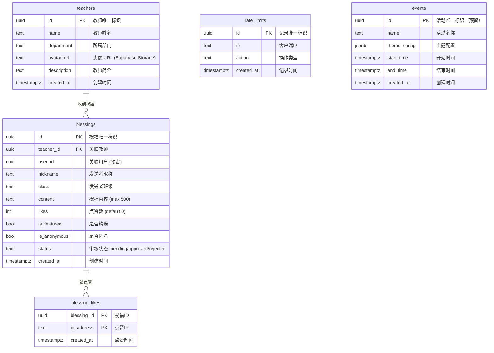
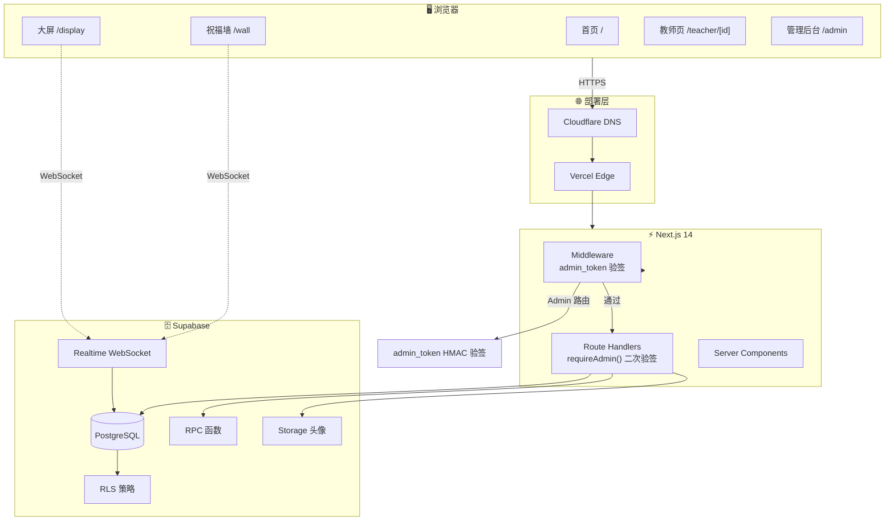
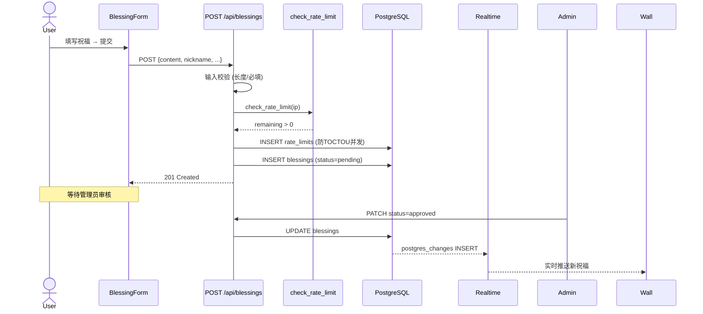
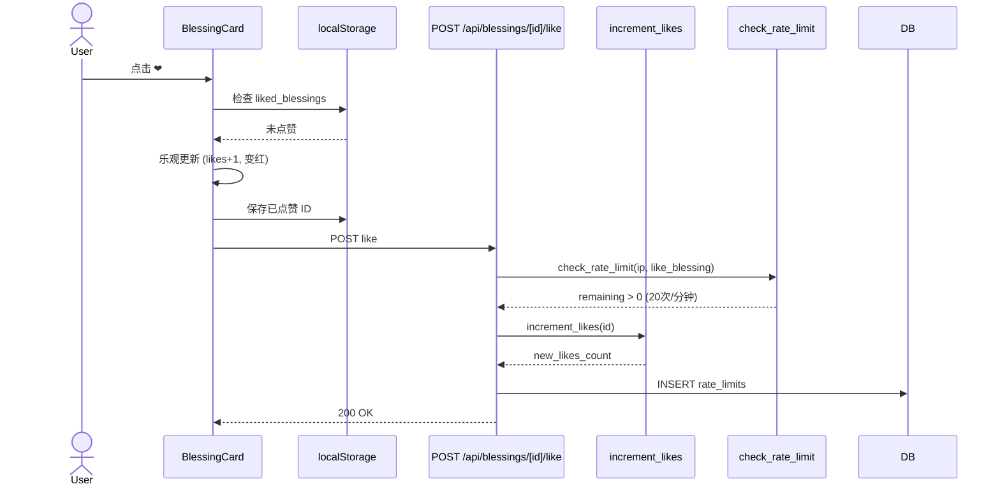

# 🏗 架构文档 — 教师节祝福墙

---

## 技术栈

| 层 | 技术 |
| :--- | :--- |
| **前端框架** | Next.js 14 (App Router) + TypeScript |
| **样式** | Tailwind CSS（Glassmorphism 毛玻璃主题） |
| **动画** | Framer Motion + tsParticles v4 + Canvas Confetti |
| **数据获取** | SWR + useSWRInfinite + Supabase Realtime |
| **后端 API** | Next.js Route Handlers |
| **数据库** | Supabase PostgreSQL + RLS + Realtime |
| **存储** | Supabase Storage（教师头像） |
| **认证** | Admin: admin_token HMAC (Supabase Auth 不参与) |
| **部署** | Vercel + Cloudflare DNS 代理 |
| **测试** | Vitest + Playwright E2E + k6 负载测试 |

---

## 目录结构

```
├── src/
│   ├── app/                       # Next.js App Router
│   │   ├── page.tsx               # 首页（故事式时间线）
│   │   ├── layout.tsx             # 根布局 + SEO metadata
│   │   ├── wall/page.tsx          # 祝福墙（无限滚动 + Realtime）
│   │   ├── display/page.tsx       # 大屏模式（全屏轮播）
│   │   ├── teacher/[id]/page.tsx  # 教师主页（SSR）
│   │   ├── admin/
│   │   │   ├── page.tsx           # 管理后台（审核 + 统计 + 教师管理）
│   │   │   └── login/page.tsx     # 管理员登录
│   │   └── api/                   # API Route Handlers
│   │       ├── blessings/         # 祝福 CRUD + 点赞 + 统计
│   │       ├── teachers/          # 教师列表 + 详情
│   │       └── admin/             # 管理审核 + 批量删除 + 头像上传
│   ├── components/
│   │   ├── home/                  # 首页组件
│   │   │   ├── StarBackground.tsx # tsParticles 星空
│   │   │   ├── BlessingGalaxy.tsx # 祝福星河（斐波那契螺旋）
│   │   │   ├── StatsPanel.tsx     # 数据看板
│   │   │   ├── CountUp.tsx        # 数字滚动动画
│   │   │   └── FallingPetals.tsx  # 花瓣飘落动画
│   │   ├── blessing/              # 祝福相关组件
│   │   │   ├── BlessingCard.tsx   # 祝福卡片（点赞）
│   │   │   ├── BlessingForm.tsx   # 提交表单（弹窗）
│   │   │   ├── ConfettiTrigger.tsx # 彩带庆祝特效
│   │   │   ├── LikeBurst.tsx      # 点赞爱心爆发动画
│   │   │   └── SortToggle.tsx     # 排序切换按钮
│   │   ├── admin/                 # 管理后台组件
│   │   │   └── TeacherManager.tsx # 教师管理面板
│   │   └── ui/                    # 通用 UI 组件
│   │       ├── GlassCard.tsx      # 毛玻璃卡片
│   │       ├── NavHeader.tsx      # 玻璃态导航栏
│   │       ├── PageTransition.tsx # 页面转场动画
│   │       ├── ThemeToggle.tsx    # 主题切换按钮
│   │       ├── QRCode.tsx         # Canvas QR 码
│   │       └── ShareButton.tsx    # 分享链接复制
│   ├── lib/
│   │   ├── supabase/              # Supabase 客户端封装
│   │   │   ├── client.ts          # 浏览器端（含 Realtime）
│   │   │   └── server.ts          # 服务端（含 Admin + Anon）
│   │   ├── csrf.ts                # CSRF 令牌生成（Double Submit Cookie）
│   │   ├── csrf-client.ts         # 客户端 CSRF 工具（缓存 + 获取）
│   │   └── utils.ts               # 工具函数
│   ├── hooks/
│   │   ├── useInfiniteScroll.ts   # 无限滚动 Hook
│   │   └── useTheme.ts            # 主题切换 Hook
│   ├── types/
│   │   ├── index.ts               # 全局类型定义
│   │   └── turnstile.d.ts         # Turnstile 类型声明
│   ├── tests/                     # 测试文件
│   │   ├── setup.ts               # Vitest 配置
│   │   ├── utils.test.ts          # 工具函数测试
│   │   ├── validation.test.ts     # API 验证逻辑测试
│   │   ├── api-types.test.ts      # API 类型守卫测试
│   │   ├── GlassCard.test.tsx     # GlassCard 组件测试
│   │   └── BlessingCard.test.tsx  # BlessingCard 组件测试
├── e2e/                           # Playwright E2E 测试
│   ├── homepage.spec.ts           # 首页测试
│   ├── blessing.spec.ts           # 祝福墙测试
│   ├── admin.spec.ts              # 管理后台测试
│   ├── teacher.spec.ts            # 教师页测试
│   └── a11y.spec.ts               # 无障碍测试
├── load-tests/                    # k6 负载测试
│   ├── smoke.js                   # 冒烟测试
│   ├── load.js                    # 负载测试
│   └── stress.js                  # 压力测试
│   └── middleware.ts              # Admin 路由鉴权中间件
├── database/
│   └── migrations/                # SQL 迁移脚本
├── docs/                          # 文档
└── public/                        # 静态资源
```

---

## ER 图



---

## 数据流图



---

## 核心交互流程

### 提交祝福



### 点赞流程



---

## 安全模型

| 层 | 机制 |
| :--- | :--- |
| **传输** | HTTPS (Vercel + Cloudflare) |
| **CSRF** | Double Submit Cookie 模式 — GET `/api/csrf` 生成随机 token → Cookie + 响应体 → 前端 POST/PATCH 携带 `X-CSRF-Token` → 服务端比对 |
| **数据库** | RLS — 公开 SELECT 仅看 `approved`，INSERT 默认 `pending` |
| **点赞** | `SECURITY DEFINER` RPC 绕过 RLS |
| **管理 API** | admin_token HMAC 签名 cookie + Middleware 验签 + requireAdmin() 二次验签（Supabase Auth 不参与） |
| **上传** | service_role key，仅服务端使用 |
| **限流** | `check_rate_limit` RPC：提交 3次/10分钟/IP、点赞 20次/分钟/IP、管理员登录 5次/分钟/IP |
| **人机验证** | Cloudflare Turnstile（可选，配置密钥后激活） |
| **输入校验** | 服务端严格校验（长度、必填、类型）；Admin PATCH 字段白名单仅允许 status + is_featured |

---

## 性能策略

| 策略 | 实现 |
| :--- | :--- |
| **组件懒加载** | `next/dynamic` — tsParticles / Confetti / QRCode / 表单 |
| **图片优化** | `next/image` → WebP |
| **API 缓存** | `Cache-Control: s-maxage + stale-while-revalidate` |
| **无限滚动** | `useSWRInfinite` + `IntersectionObserver` |
| **真实时** | Supabase Realtime WebSocket（替代轮询） |
| **粒子渲染** | Canvas（非 DOM，tsParticles） |
| **动画降级** | `prefers-reduced-motion` 媒体查询 |
