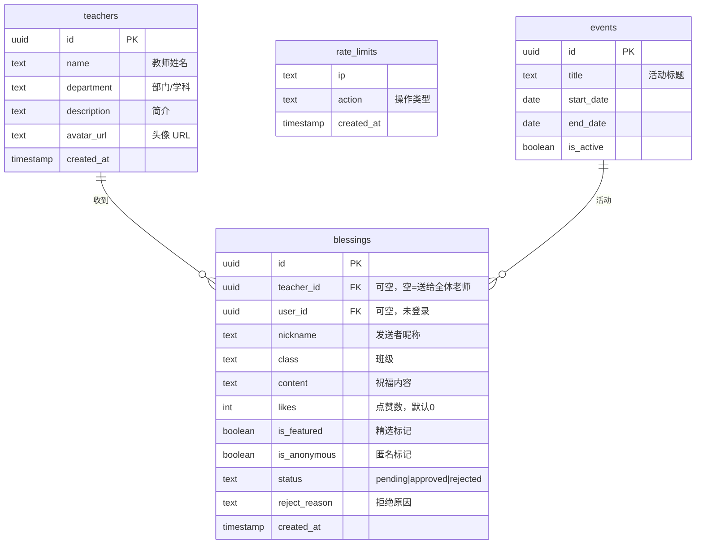

# 📐 TECHNICAL_DESIGN.md — 教师节祝福平台 技术设计文档

> 版本：v1.0 | 日期：2026-08-07 | 作者：Teacher Wishes Team

---

## 目录

1. [系统架构](#1-系统架构)
2. [数据模型](#2-数据模型)
3. [API 设计](#3-api-设计)
4. [组件设计](#4-组件设计)
5. [数据流](#5-数据流)
6. [安全架构](#6-安全架构)
7. [性能策略](#7-性能策略)
8. [部署架构](#8-部署架构)
9. [监控与可观测性](#9-监控与可观测性)
10. [测试策略](#10-测试策略)

---

## 1. 系统架构

### 1.1 总体架构图

```
┌─────────────────────────────────────────────────────────┐
│                      客户端层                             │
│  ┌──────────┐  ┌──────────┐  ┌──────────┐  ┌─────────┐ │
│  │ 桌面浏览器 │  │ 移动浏览器 │  │ 大屏投影  │  │ 管理后台 │ │
│  └─────┬─────┘  └─────┬─────┘  └─────┬─────┘  └────┬────┘ │
└────────┼──────────────┼──────────────┼──────────────┼──────┘
         │              │              │              │
         ▼              ▼              ▼              ▼
┌─────────────────────────────────────────────────────────┐
│                    Vercel Edge CDN                        │
│  ┌──────────────────────────────────────────────────┐   │
│  │  静态资源缓存 (JS/CSS/图片) + ISR 增量静态再生      │   │
│  │  Cache-Control: s-maxage=5, stale-while-revalidate │   │
│  └──────────────────────────────────────────────────┘   │
└────────────────────────┬────────────────────────────────┘
                         │
                         ▼
┌─────────────────────────────────────────────────────────┐
│                Next.js 14 (App Router)                    │
│                                                          │
│  ┌─────────────┐  ┌──────────────┐  ┌───────────────┐  │
│  │ Server       │  │ API Route    │  │ Client        │  │
│  │ Components   │  │ Handlers     │  │ Components    │  │
│  │              │  │              │  │               │  │
│  │ • teacher页  │  │ • blessings  │  │ • wall 页面   │  │
│  │ • layout     │  │ • admin      │  │ • 首页动画     │  │
│  │ • metadata   │  │ • teachers   │  │ • display 大屏 │  │
│  │              │  │ • csrf       │  │ • 表单弹窗     │  │
│  └──────┬───────┘  └──────┬───────┘  └───────┬───────┘  │
│         │                 │                   │          │
│  ┌──────┴─────────────────┴───────────────────┴───────┐  │
│  │              Middleware (鉴权层)                     │  │
│  │  • /admin & /api/admin 路径 → Supabase Auth 验证    │  │
│  │  • /api/* POST/PATCH → CSRF Token 校验              │  │
│  └──────────────────────┬──────────────────────────────┘  │
└─────────────────────────┼─────────────────────────────────┘
                          │
                          ▼
┌─────────────────────────────────────────────────────────┐
│                      Supabase                             │
│                                                          │
│  ┌──────────┐  ┌──────────┐  ┌──────────┐  ┌─────────┐ │
│  │PostgreSQL│  │  Auth    │  │ Realtime │  │ Storage │ │
│  │          │  │          │  │          │  │         │ │
│  │ • RLS   │  │ • Email  │  │ • WS 推送│  │ • 头像  │ │
│  │ • RPC   │  │ • Cookie │  │ • 200连接│  │ • 1GB   │ │
│  │ • 索引  │  │          │  │          │  │         │ │
│  └──────────┘  └──────────┘  └──────────┘  └─────────┘ │
└─────────────────────────────────────────────────────────┘
```

### 1.2 技术选型理由

| 选择 | 理由 | 替代方案 |
|:---|:---|:---|
| Next.js 14 App Router | SSR/SSG/ISR 灵活切换，Server Components 减少客户端 JS | Nuxt 3, Remix |
| Supabase | 一站式后端（DB + Auth + Realtime + Storage），免费额度足够 | Firebase, 自建 PostgreSQL |
| Tailwind CSS | 原子化 CSS，Glassmorphism 主题易于实现 | CSS Modules, styled-components |
| Framer Motion | 声明式动画 API，layoutId 支持排序重排 | GSAP, react-spring |
| SWR | 轻量数据请求，内置缓存/重试/无限滚动 | TanStack Query, RTK Query |
| k6 | 脚本化负载测试，CI 可集成 | JMeter, Artillery |

---

## 2. 数据模型

### 2.1 ER 图



### 2.2 核心索引策略

```sql
-- blessings 表
CREATE INDEX idx_blessings_status ON blessings(status);         -- 审核筛选
CREATE INDEX idx_blessings_teacher ON blessings(teacher_id);    -- 教师页查询
CREATE INDEX idx_blessings_created ON blessings(created_at);    -- 时间排序
CREATE INDEX idx_blessings_likes ON blessings(likes);           -- 点赞排序
CREATE INDEX idx_blessings_featured ON blessings(is_featured);  -- 精选筛选

-- rate_limits 表
CREATE INDEX idx_ratelimit_ip_action ON rate_limits(ip, action, created_at);  -- 速率检查
```

### 2.3 RLS 策略矩阵

| 操作 | anon (匿名) | authenticated (登录) | service_role (服务端) |
|:---|:---|:---|:---|
| SELECT blessings (approved) | ✅ | ✅ | ✅ |
| SELECT blessings (全部) | ❌ | ❌ | ✅ |
| INSERT blessings | ✅ (nickname/content) | ✅ | ✅ |
| UPDATE blessings | ❌ | ❌ | ✅ |
| DELETE blessings | ❌ | ❌ | ✅ |
| SELECT teachers | ✅ | ✅ | ✅ |
| INSERT/UPDATE teachers | ❌ | ❌ | ✅ |

### 2.4 存储过程（RPC）

```sql
-- 原子递增点赞（SECURITY DEFINER 绕过 RLS）
CREATE OR REPLACE FUNCTION increment_likes(blessing_id UUID)
RETURNS INT AS $$
DECLARE new_likes INT;
BEGIN
  UPDATE blessings SET likes = likes + 1 WHERE id = blessing_id
  RETURNING likes INTO new_likes;
  RETURN new_likes;
END;
$$ LANGUAGE plpgsql SECURITY DEFINER;

-- 速率限制检查
CREATE OR REPLACE FUNCTION check_rate_limit(
  client_ip TEXT, action_name TEXT, max_requests INT, window_minutes INT
) RETURNS INT AS $$
DECLARE recent_count INT;
BEGIN
  SELECT COUNT(*) INTO recent_count FROM rate_limits
  WHERE ip = client_ip AND action = action_name
    AND created_at > NOW() - (window_minutes || ' minutes')::INTERVAL;
  RETURN GREATEST(0, max_requests - recent_count);
END;
$$ LANGUAGE plpgsql SECURITY DEFINER;
```

---

## 3. API 设计

### 3.1 端点总览

| 方法 | 路径 | 鉴权 | 缓存 | 说明 |
|:---|:---|:---|:---|:---|
| GET | `/api/blessings` | 无 | s-maxage=5s | 分页祝福列表，支持 sort/time/likes |
| POST | `/api/blessings` | CSRF | 无 | 提交祝福，IP 限流 3/10min |
| POST | `/api/blessings/[id]/like` | CSRF | 无 | 点赞（RPC 原子递增） |
| GET | `/api/blessings/stats` | 无 | s-maxage=30s | 统计数据看板 |
| GET | `/api/teachers` | 无 | s-maxage=300s | 教师列表 |
| GET | `/api/teachers/[id]` | 无 | s-maxage=300s | 教师详情 + 祝福 |
| GET | `/api/admin/blessings` | Auth | 无 | 管理后台祝福列表 |
| PATCH | `/api/admin/blessings` | Auth+CSRF | 无 | 批量审核/置顶 |
| POST | `/api/admin/login` | CSRF | 无 | 管理登录 |
| POST | `/api/admin/upload` | Auth+CSRF | 无 | 头像上传 |
| GET | `/api/csrf` | 无 | 无 | 颁发 CSRF Token |

### 3.2 请求/响应规范

```typescript
// 分页响应
interface PaginatedResponse<T> {
  data: T[];
  count: number;
  page: number;
  pageSize: number;
}

// 错误响应
interface ApiErrorResponse {
  error: string;
  detail?: string;
  code?: string;
}

// 成功响应
interface ApiSuccessResponse {
  success: boolean;
  message?: string;
  data?: unknown;
}

// 状态码使用
// 200 — 成功查询
// 201 — 成功创建
// 400 — 参数校验失败
// 401 — 未授权
// 404 — 资源不存在
// 429 — 速率限制
// 500 — 服务端错误（PGRST103 → 空列表而非 500）
```

### 3.3 CSRF 保护模式

采用 **Double Submit Cookie** 模式：

```
1. 客户端访问页面 → GET /api/csrf → 服务端生成随机 token
2. 服务端返回 token JSON + Set-Cookie: csrf_token=<token>
3. 客户端 POST/PATCH 时 → 在请求头 X-CSRF-Token + Cookie 中同时携带
4. 服务端比对 Header token === Cookie token → 通过/拒绝
```

---

## 4. 组件设计

### 4.1 组件树

```
RootLayout (Server)
├── PageTransition (Client)        — 页面过渡动画
│   ├── HomePage (Client)
│   │   ├── StarBackground          — tsParticles 星空（懒加载）
│   │   ├── BlessingGalaxy          — 斐波那契螺旋星河（懒加载）
│   │   │   ├── TeacherStar × N     — 教师天体
│   │   │   └── BlessingStar × N    — 祝福星星
│   │   └── StatsPanel              — 数据看板（懒加载）
│   │       └── CountUp × 3         — 数字滚动动画
│   │
│   ├── WallPage (Client)
│   │   ├── BlessingCard × N        — 祝福卡片（layoutId 动画）
│   │   │   └── GlassCard           — 毛玻璃容器
│   │   ├── BlessingForm (Lazy)     — 提交弹窗
│   │   │   └── TeacherSelector     — 教师搜索下拉
│   │   ├── SortToggle              — 排序切换
│   │   └── ConfettiTrigger (Lazy)  — 彩带特效
│   │
│   ├── TeacherPage (Server)
│   │   ├── ShareButton             — 一键分享
│   │   └── SortToggle              — 排序切换
│   │
│   ├── DisplayPage (Client)
│   │   └── QRCode (Lazy)           — 二维码
│   │
│   └── AdminPage (Client)
│       └── TeacherManager          — 教师管理
│
├── Analytics (Vercel)             — 页面统计
└── Sentry (可选)                   — 错误追踪
```

### 4.2 Server/Client 边界原则

```
Server Component (SSR/SSG/ISR)       Client Component ('use client')
├── metadata / SEO                   ├── useState / useEffect
├── 数据库直查                        ├── 事件处理 (onClick/onSubmit)
├── 无交互的静态内容                   ├── 浏览器 API (localStorage)
├── Suspense 包裹的动态组件            ├── Framer Motion 动画
└── layout / error / loading         └── SWR 数据请求
```

### 4.3 关键组件设计模式

#### 排序重排动画（BlessingCard）

```typescript
// BlessingCard.tsx — layoutId 实现排序平滑过渡
<motion.div
  layout
  layoutId={`blessing-${blessing.id}`}
  transition={{ layout: { duration: 0.4, ease: 'easeInOut' } }}
>
```

配合墙页面切换排序时：
1. SWR key 变化 → 自动重新拉取数据
2. `useEffect([sortBy])` → `setSize(1)` 重置分页
3. 卡片数据变化 → `layoutId` 触发 framer-motion 重排动画

#### 无限滚动（useSWRInfinite + IntersectionObserver）

```
SWR Key Generator           IntersectionObserver
      │                            │
      ├─ page=1&sort=time          ├─ sentinelRef 进入视口
      ├─ page=2&sort=time          ├─ hasMore === true?
      ├─ page=3&sort=time          ├─ isLoading === false?
      └─ null (到末尾)             └─ → loadMore() → setSize(size+1)
```

---

## 5. 数据流

### 5.1 祝福提交流

```
用户填写表单
  │
  ├─ 1. Turnstile 人机验证（可选）
  ├─ 2. CSRF Token 获取（GET /api/csrf）
  │
  ▼
POST /api/blessings
  │
  ├─ 3. CSRF 校验（Header vs Cookie）
  ├─ 4. 输入校验（长度 ≤ 500，非空）
  ├─ 5. IP 速率限制（RPC check_rate_limit）
  ├─ 6. Turnstile 服务端验证
  │
  ▼
Supabase INSERT
  │
  ├─ 7. RLS 策略检查
  ├─ 8. 写入 blessings 表（status=pending）
  ├─ 9. Realtime 广播 INSERT 事件
  │
  ▼
响应 201
  │
  ├─ 10. 前端 Confetti 彩带特效
  ├─ 11. SWR mutate() 刷新列表
  └─ 12. 关闭弹窗
```

### 5.2 实时更新流

```
数据库 blessings 表
  │
  ├─ INSERT (status=approved)
  │   └─ Realtime Channel: "blessings-wall"
  │       └─ 浏览器 WebSocket 接收
  │           └─ SWR mutate() → 列表自动刷新
  │
  ├─ UPDATE (likes/status)
  │   └─ 同上
  │
  └─ 大屏 display 页面
      └─ 独立 Realtime Channel
          └─ 新祝福插入轮播队列
```

### 5.3 点赞流（乐观更新）

```
用户点击点赞
  │
  ├─ 1. 检查 localStorage "liked_blessings" → 已点过？停止
  ├─ 2. 乐观更新 UI（立即 +1，禁用按钮）
  ├─ 3. 写入 localStorage
  │
  ▼
POST /api/blessings/:id/like
  │
  ├─ 4. CSRF 校验
  ├─ 5. UUID 格式校验
  ├─ 6. RPC increment_likes（原子 +1）
  │
  ▼
成功 → 不处理（UI 已更新）
失败 → 需要回滚（⚠️ 当前未实现，见 ARCHITECTURE_REVIEW P1-14）
```

---

## 6. 安全架构

### 6.1 防护层次

```
第 1 层：传输安全
  └─ HTTPS 强制（Vercel 自动）

第 2 层：CSRF 防护
  └─ Double Submit Cookie（5 个 POST/PATCH 端点）

第 3 层：输入校验
  ├─ 内容长度 ≤ 500
  ├─ 非空校验
  └─ SQL 参数化（Supabase 内置）

第 4 层：速率限制
  ├─ IP 级别：RPC check_rate_limit（3 次/10 分钟/操作）
  └─ Turnstile 人机验证（可选）

第 5 层：数据库安全
  ├─ RLS 行级安全（4 条策略）
  ├─ SECURITY DEFINER RPC（点赞/限流）
  └─ Service Role Key 隔离（仅 admin 操作）

第 6 层：鉴权
  ├─ Middleware：/admin & /api/admin → Supabase Auth
  └─ ADMIN_EMAIL 环境变量验证

第 7 层：监控
  ├─ Sentry：错误追踪（生产环境）
  └─ Vercel Analytics：异常流量检测
```

### 6.2 环境变量安全分级

```
公开（NEXT_PUBLIC_）          服务端（无 PUBLIC_）
├── SUPABASE_URL              ├── SUPABASE_SERVICE_ROLE_KEY
├── SUPABASE_ANON_KEY         ├── TURNSTILE_SECRET_KEY
├── TURNSTILE_SITE_KEY        ├── ADMIN_EMAIL
└── SENTRY_DSN                ├── ADMIN_PASSWORD（⚠️ 待修复）
                              └── SENTRY_ORG / PROJECT
```

---

## 7. 性能策略

### 7.1 缓存层次

```
CDN 层 (Vercel Edge)
  ├── 静态资源：immutable, max-age=31536000
  ├── API 响应：s-maxage=5, stale-while-revalidate=30
  ├── ISR 页面：revalidate=60
  └── HTML 页面：动态（force-dynamic）

浏览器层
  ├── SWR 内存缓存（不重复请求相同 key）
  ├── localStorage（表单记忆、点赞记录）
  └── next/image 优化缓存

数据库层
  ├── 索引覆盖核心查询
  ├── RPC 减少往返次数
  └── Realtime 替代轮询
```

### 7.2 首屏优化策略

| 策略 | 实现 | 效果 |
|:---|:---|:---|
| 代码分割 | `next/dynamic` 懒加载 tsParticles/Confetti/QRCode | 首屏 JS 87KB |
| 字体优化 | `localFont` + `display:swap` | 无 FOIT |
| 图片优化 | `next/image` WebP/AVIF + `remotePatterns` | 图片体积 -60% |
| 预连接 | `<link rel="preconnect">` Supabase | 节省 1 次 RTT |
| 骨架屏 | `loading.tsx` + dynamic loading fallback | CLS 最低 |
| 动画降级 | `prefers-reduced-motion` + `prefers-reduced-transparency` | 低端设备不卡顿 |

### 7.3 容量估算

详见 [`docs/CAPACITY.md`](./CAPACITY.md)

| 场景 | 上限 | 瓶颈 |
|:---|:---|:---|
| 纯浏览 | 500-800 人 | Vercel 12 并发函数 + CDN 缓存 |
| 实时在线 | 200 人 | Supabase Realtime 连接数 |
| 写操作 | 50-100 条/分钟 | IP 限流 + 函数并发 |

---

## 8. 部署架构

### 8.1 生产环境

```
GitHub (源代码)
  │
  ├── Git Push → Vercel 自动构建
  │   ├── npm install
  │   ├── next build
  │   └── 部署到 Edge Network
  │
  └── GitHub Actions CI
      ├── Lint + TypeCheck
      ├── Vitest 单元测试
      └── Next.js Build 验证

Vercel (teacher.shh32010.dpdns.org)
  │
  ├── Edge CDN (全球 100+ 节点)
  ├── Serverless Functions (API Routes)
  └── ISR Cache (教师页)

Supabase (数据库/认证/存储)
  │
  ├── PostgreSQL (us-east-1)
  ├── Auth (Email/Password)
  ├── Realtime (WebSocket)
  └── Storage (S3 兼容)
```

### 8.2 环境变量配置

部署时在 Vercel Dashboard → Settings → Environment Variables 中配置：

```
NEXT_PUBLIC_SUPABASE_URL
NEXT_PUBLIC_SUPABASE_ANON_KEY
SUPABASE_SERVICE_ROLE_KEY
ADMIN_EMAIL
ADMIN_PASSWORD        ← ⚠️ 上线前必设
NEXT_PUBLIC_SENTRY_DSN ← 可选
```

### 8.3 一键部署

[](https://vercel.com/new/clone?repository-url=https://github.com/shh32010/Teacher-wishes)

---

## 9. 监控与可观测性

### 9.1 监控矩阵

| 层级 | 工具 | 指标 |
|:---|:---|:---|
| 页面性能 | Vercel Analytics | Web Vitals (LCP/CLS/INP), PV/UV |
| 错误追踪 | Sentry | 客户端/服务端/Edge 异常，含堆栈 |
| API 延迟 | Supabase Dashboard | 查询耗时、慢查询日志 |
| 实时连接 | Supabase Dashboard | Realtime 并发连接数 |
| 带宽 | Vercel + Supabase Dashboard | 月度流量消耗 |

### 9.2 告警阈值

| 指标 | 阈值 | 通道 |
|:---|:---|:---|
| API 错误率 > 1% | Sentry Alert | Email |
| Realtime 连接 > 150 | Supabase Dashboard | 手动检查 |
| p95 延迟 > 1000ms | k6 负载测试 | CI 输出 |
| 带宽 > 80% 配额 | Vercel Dashboard | 手动检查 |

---

## 10. 测试策略

### 10.1 测试金字塔

```
         ┌──────┐
         │ E2E  │  Playwright · 25 用例
         │ 25   │  关键用户路径
         ├──────┤
         │ 集成  │  Vitest · API 类型守卫
         │ ~10  │  验证逻辑 + 状态机
         ├──────┤
         │ 单元  │  Vitest · 71 用例
         │ 71   │  utils + 组件 + hooks
         └──────┘
              ↑
         ┌──────┐
         │ 负载  │  k6 · smoke/load/stress
         │  3   │  容量验证
         └──────┘
```

### 10.2 测试覆盖现状

| 层次 | 已覆盖 | 缺失 |
|:---|:---|:---|
| utils 工具函数 | ✅ cn/formatDate/truncate | — |
| 类型守卫 | ✅ Blessing/Teacher/Stats | — |
| 组件 | ✅ GlassCard/BlessingCard | BlessingForm/BlessingGalaxy |
| API 路由 | ❌ | blessings/stats/admin/like/login |
| CSRF 工具 | ❌ | generate/validate |
| Hooks | ❌ | useInfiniteScroll |
| Middleware | ❌ | 鉴权分支逻辑 |

### 10.3 推荐补充测试

```
P0 — blessings/route.ts     → POST 提交 + GET 分页 + 限流分支
P0 — csrf.ts                → 生成/验证/环境分支
P1 — middleware.ts           → admin 路径鉴权
P1 — like/route.ts           → RPC 调用 + UUID 校验
P1 — admin/blessings/route.ts → PATCH 白名单
```

---

## 附录

### A. 文件规模统计

| 目录 | 文件数 | 总行数 | 最大文件 |
|:---|:---|:---|:---|
| `src/app/` | 15 | ~1800 | wall/page.tsx (310) |
| `src/components/` | 14 | ~2300 | BlessingGalaxy.tsx (521 ⚠️) |
| `src/lib/` | 5 | ~250 | csrf.ts (80) |
| `src/app/api/` | 10 | ~600 | blessings/route.ts (160) |
| `e2e/` | 6 | ~600 | admin.spec.ts (180) |
| `load-tests/` | 3 | ~400 | stress.js (250) |

### B. 术语表

| 缩写 | 全称 |
|:---|:---|
| RLS | Row Level Security（行级安全） |
| RPC | Remote Procedure Call（远程过程调用） |
| SSR | Server-Side Rendering（服务端渲染） |
| ISR | Incremental Static Regeneration（增量静态再生） |
| CSRF | Cross-Site Request Forgery（跨站请求伪造） |
| VU | Virtual User（虚拟用户，k6 术语） |
